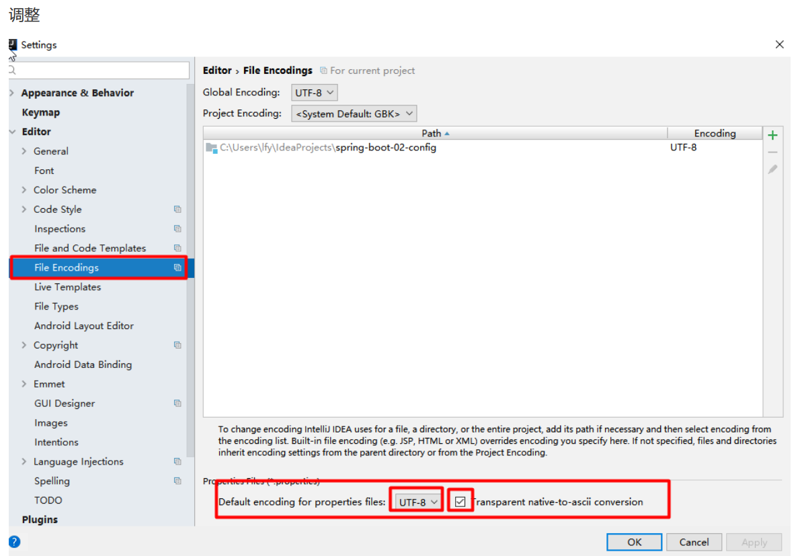
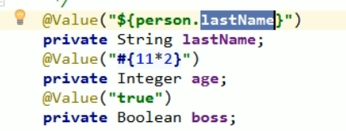
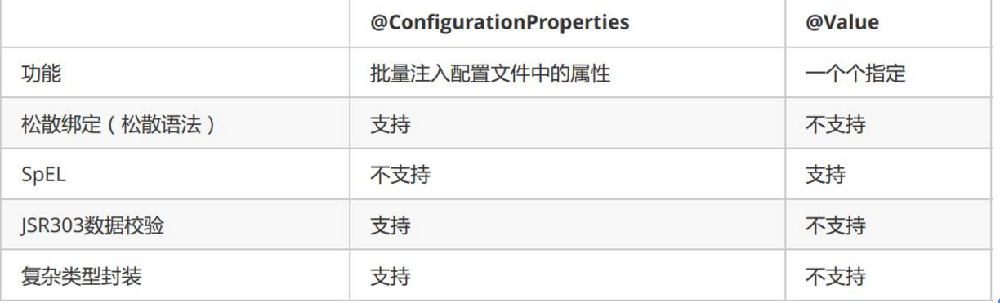
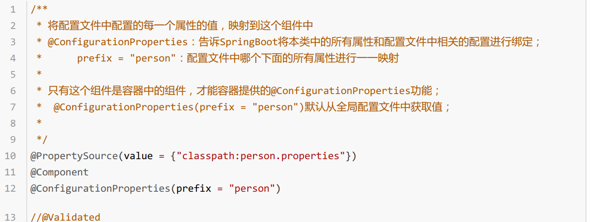
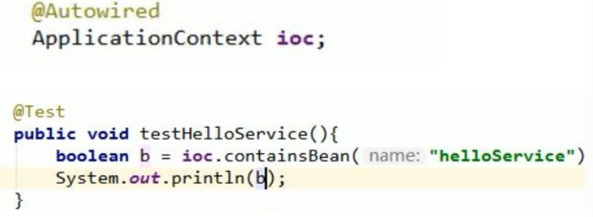
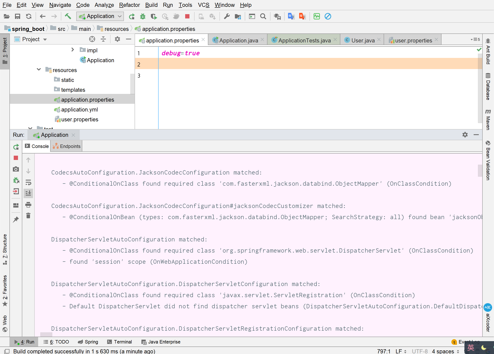
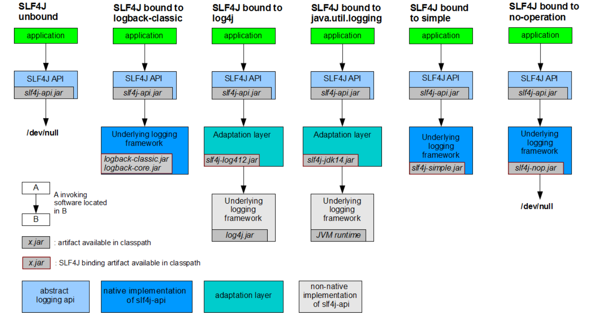
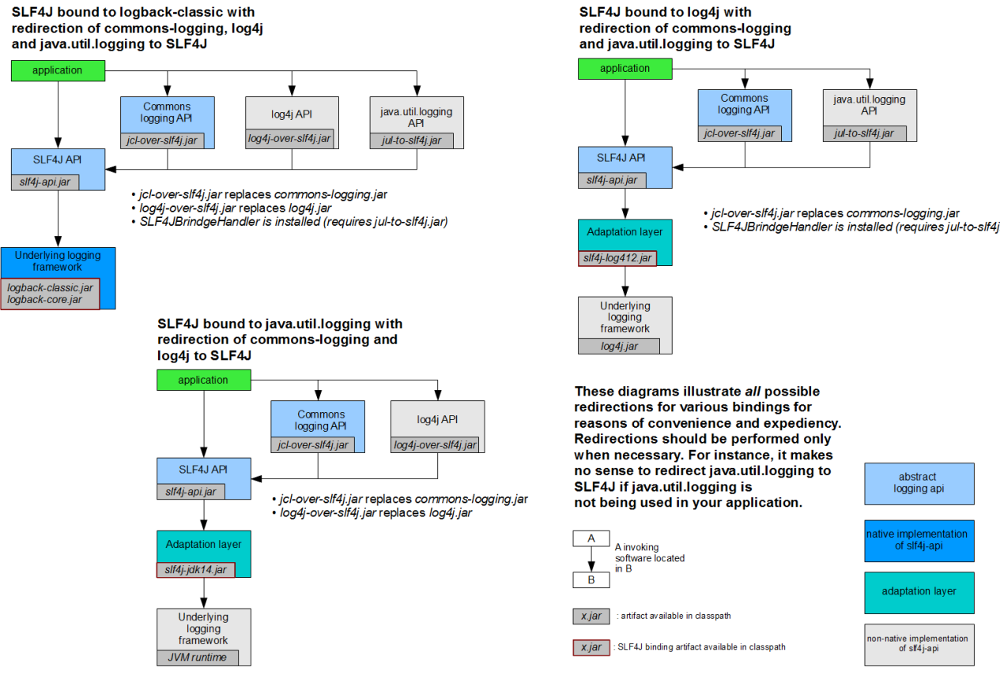
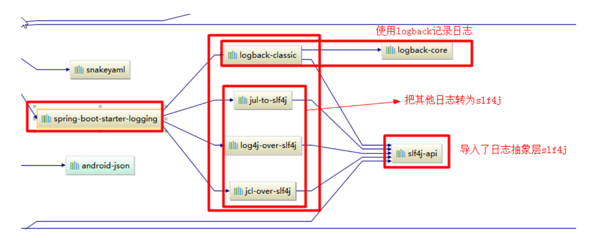
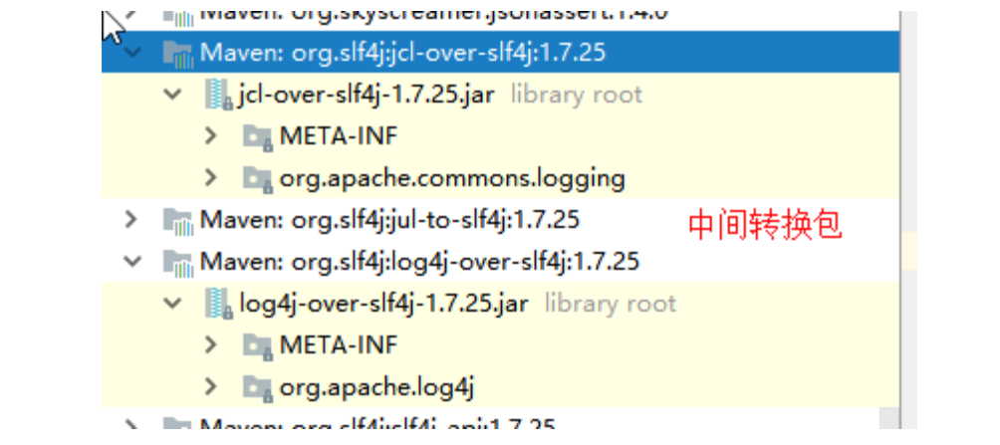

# spring Boot

##  	spring boot入门

​	１、导入依赖：

```xml
<!－－主要配置ｊａｒ包－－＞
<parent>
    <groupId>org.springframework.boot</groupId>
    <artifactId>spring‐boot‐starter‐parent</artifactId>
    <version>1.5.9.RELEASE</version>
</parent>
＜！－－真正用来管理ｓｐｒｉｎｇ　ｂｏｏｔ应用中的所有依赖版本－－＞
<dependencies>
	<dependency>
        <groupId>org.springframework.boot</groupId>
        <artifactId>spring‐boot‐starter‐web</artifactId>
    </dependency>
</dependencies>
```

Spring Boot的版本仲裁中心；
以后我们导入依赖默认是不需要写版本；（没有在dependencies里面管理的依赖自然需要声明版本号） 

​	２、启动器

```xml
<dependency>
    <groupId>org.springframework.boot</groupId>
    <artifactId>spring‐boot‐starter‐web</artifactId>
</dependency>
```

spring-boot-starter-web：

spring-boot-starter：spring-boot场景启动器；帮我们导入了web模块正常运行所依赖的组件；

Spring Boot将所有的功能场景都抽取出来，做成一个个的starters（启动器），只需要在项目里面引入这些starter相关场景的所有依赖都会导入进来。要用什么功能就导入什么场景的启动器


​	3、主程序，主入口类

此注解标明此程序为springBoot主程序

```java
@SpringBootApplication
public class Hello {
    public static void main(String[] args) {
        SpringApplication.run(Hello.class, args);
    }
}
```

@SpringBootApplication: Spring Boot应用标注在某个类上说明这个类是SpringBoot的主配置类，SpringBoot就应该运行这个类的main方法来启动SpringBoot应用；

```java
@Target(ElementType.TYPE)
@Retention(RetentionPolicy.RUNTIME)
@Documented
@Inherited
@SpringBootConfiguration
@EnableAutoConfiguration
@ComponentScan(excludeFilters = {
@Filter(type = FilterType.CUSTOM, classes = TypeExcludeFilter.class),
@Filter(type = FilterType.CUSTOM, classes = AutoConfigurationExcludeFilter.class) })
public @interface SpringBootApplication {
```

@SpringBootConfiguration:Spring Boot的配置类；

标注在某个类上，表示这是一个Spring Boot的配置类；

---

@Configuration:配置类上来标注这个注解；

配置类 ----- 配置文件；配置类也是容器中的一个组件；@Component

---

@EnableAutoConfiguration：开启自动配置功能；

以前我们需要配置的东西，Spring Boot帮我们自动配置；@EnableAutoConfiguration告诉SpringBoot开启自动配置功能；这样自动配置才能生效；

```java
@AutoConfigurationPackage
@Import(EnableAutoConfigurationImportSelector.class)
public @interface EnableAutoConfiguration {
```

@AutoConfigurationPackage：自动配置包

@Import(AutoConfigurationPackages.Registrar.class)：

Spring的底层注解@Import，给容器中导入一个组件；导入的组件由

AutoConfigurationPackages.Registrar.class；

==将主配置类（@SpringBootApplication标注的类）的所在包及下面所有子包里面的所有组件扫描到Spring容器；==

@Import(EnableAutoConfigurationImportSelector.class)；

给容器中导入组件

EnableAutoConfigurationImportSelector：导入哪些组件的选择器；

将所有需要导入的组件以全类名的方式返回；这些组件就会被添加到容器中；

会给容器中导入非常多的自动配置类（xxxAutoConfiguration）；就是给容器中导入这个场景需要的所有组件，并配置好这些组件；

---

有了自动配置类，免去了我们手动编写配置注入功能组件等的工作；

SpringFactoriesLoader.loadFactoryNames(EnableAutoConfiguration.class,classLoader)；

Spring Boot在启动的时候从类路径下的META-INF/spring.factories中获取EnableAutoConfiguration指定的值，将这些值作为自动配置类导入到容器中，自动配置类就生效，帮我们进行自动配置工作；以前我们需要自己配置的东西，自动配置类都帮我们；

J2EE的整体整合解决方案和自动配置都在spring-bootautoconfigure1.5.9.RELEASE.jar


### 使用Spring Initializer快速创建Spring Boot项目

IDE都支持使用Spring的项目创建向导快速创建一个Spring Boot项目；

选择我们需要的模块；向导会联网创建Spring Boot项目；

默认生成的Spring Boot项目；

主程序已经生成好了，我们只需要我们自己的逻辑

resources文件夹中目录结构

static：保存所有的静态资源； js css images；

templates：保存所有的模板页面；（Spring Boot默认jar包使用嵌入式的Tomcat，默认不支持JSP页面）；可以使用模板引擎（freemarker、thymeleaf）；

application.properties：Spring Boot应用的配置文件；可以修改一些默认设置；


## spring boot配置文件详解

SpringBoot使用一个全局的配置文件，配置文件名是固定的；

​	•application.properties

​	•application.yml

配置文件的作用：修改SpringBoot自动配置的默认值；SpringBoot在底层都给我们自动配置好；

​	yml配置文件：

```yml
server:
  port: 8081
```

​	xml配置文件：

```xml
<server>
    <port>8081</port>
</server>
```

### yml基本语法

​	k:(空格)v：表示一对键值对（空格必须有）；

以空格的缩进来控制层级关系；只要是左对齐的一列数据，都是同一个层级的

```yml
server:
    port: 8081
    path: /hello
```

属性和值也是大小写敏感；

​	值的写法：

#### 字面量：普通的值（数字，字符串，布尔）

k: v：字面直接来写；

​	字符串默认不用加上单引号或者双引号；

""：双引号；不会转义字符串里面的特殊字符；特殊字符会作为本身想表示的意思

​	name: "zhangsan \n lisi"：输出；zhangsan 换行 lisi

''：单引号；会转义特殊字符，特殊字符最终只是一个普通的字符串数据

​	name: ‘zhangsan \n lisi’：输出；zhangsan \n lisi

#### 对象、Map（属性和值）（键值对）

​	k: v：在下一行来写对象的属性和值的关系；注意缩进

​	对象还是k: v的方式

```yml
friends:
lastName: zhangsan
age: 20
```

​	行内写法：

```yml
friends: {lastName: zhangsan,age: 18}
```

#### 数组（list、set）

用 -值表示数组的每一个元素

```yml
pets: [cat,dog,pig]
```

### 配置文件注入

#### yml方式

application.yml配置文件：

```yml
配置文件yml：
user:
    id: 1
    name: 王老五
    age: 233
    identity: 天外飞仙
    money: {k1: v1,k2: v2}
    lists:
      - emm
      - smm
      - cmm
    profession:
      duties: 扫地僧
      wage: 9999999999
```

javaBean:

```java
User
/*
@ConfigurationProperties此注解告诉springboot将本类中的所有属性和配置文件汇总的相关配置进行绑定；
prefix = "user"：告诉配置文件中是指定的某个bean下的所有属性进行映射
配置文件中的每一个属性的值映射到此组件中

只有此组件是容器中的组件，容器才能提供注解@ConfigurationProperties
*/
@Component //此注解将普通pojo实例化到容器中，不属于@Controller、@Services等的时候），我们就可以使用@Component来标注这个类。
@ConfigurationProperties(prefix = "user")
public class User {

    private int id;
    private String name;
    private String age;
    private String identity;

    private Map<String, Object> money;
    private List<Object> lists;
    private Profession profession;
    }
    
    
profession
public class Profession {

    private String duties;
    private String wage;
    }
```

#### properties方式

​	application.properties文件：

```properties
user.id=2
user.name=王老菊
user.age=233
user.identity=哈哈哈
user.money.k1=v1
user.money.k2=v2
user.lists=你,可,真,棒
user.profession.duties=打酱油
user.profession.wage
```

==注意：properties配置文件在idea中输出可能会乱码==




==可以在pom文件中导入一个配置，编写配置文件会有提示信息：==

```xml
<!‐‐导入配置文件处理器，配置文件进行绑定就会有提示‐‐>
<dependency>
    <groupId>org.springframework.boot</groupId>
    <artifactId>spring‐boot‐configuration‐processor</artifactId>
    <optional>true</optional>
</dependency>
```


在bean中属性上除了使用*@ConfigurationProperties*注解也可以6使用@Value注解进行绑定@Value注解从配置文件或者环境变量中获取值，可以使用以下多种写法

字面量或者${key}或者#{EL}



​	

#### @Value获取值和@ConfigurationProperties获取值比较：

=

==注意：@Value不支持复杂类型封装，如集合，对象等等。支持基础类型==

配置文件无论是yml还是properties两种注解都能获取到值

我们只是在某个业务逻辑中需要获取一下配置文件中的某项值，使用@Value；

我们专门编写了一个javaBean来和配置文件进行映射，我们就直接使用@ConfigurationProperties；


@ConfigurationPropertie数据校验功能：

@Validated此注解配合@ConfigurationPropertie进行jsr303数据校验


#### @PropertySource&@ImportResource

@ConfigurationPropertie注解是默认从全局配置文件中获取值，一旦数据不存在全局配置文件中则无法获取到值。

可以使用@PropertySource注解加载指定配置文件，从指定的配置文件获取到数据值

标明从user.properties配置文件中获取数据

=

@ImportResource：导入Spring的配置文件，让配置文件里面的内容生效；

Spring Boot里面没有Spring的配置文件，我们自己编写的配置文件，也不能自动识别；

想让Spring的配置文件生效，加载进来；@ImportResource标注在一个配置类上

```java
@ImportResource(locations = {"classpath:beans.xml"})
导入Spring的配置文件让其生效
```

```xml
配置文件：
<?xml version="1.0" encoding="UTF‐8"?>
<beans xmlns="http://www.springframework.org/schema/beans"
xmlns:xsi="http://www.w3.org/2001/XMLSchema‐instance"
xsi:schemaLocation="http://www.springframework.org/schema/beans
http://www.springframework.org/schema/beans/spring‐beans.xsd">
<bean id="helloService" class="com.atguigu.springboot.service.HelloService"></bean>
</beans>
```

​	测试容器中是否含有指定bean：

​		返回值为boolean值



在springboot中不推荐xml配置这种方式：

​	可以使用全注解方式：

​		1、配置类@Configuration------>Spring配置文件

​		2、使用@Bean给容器中添加组件

```java
/**
* @Configuration：指明当前类是一个配置类；就是来替代之前的Spring配置文件
* 在配置文件中用<bean><bean/>标签添加组件
*/

@Configuration
public class MyAppConfig {
//将方法的返回值添加到容器中；容器中这个组件默认的id就是方法名
@Bean
public HelloService helloService02(){
System.out.println("配置类@Bean给容器中添加组件了...");
return new HelloService();
}
}
```

### 配置文件占位符

#### 随机数

```properties
${random.value}、${random.int}、${random.long}
${random.int(10)}、${random.int[1024,65536]}
```

#### 占位符获取之前配置的值，如果没有可以是用:指定默认值

``` xml
person.last‐name=张三${random.uuid}
person.age=${random.int}
person.birth=2017/12/15
person.boss=false
person.maps.k1=v1
person.maps.k2=14
person.lists=a,b,c
person.dog.name=${person.hello:hello}_dog
person.dog.age=15
```

### profile

#### 多profile文件

我们在主配置文件编写的时候，文件名可以是 application-{profile}.properties/yml

默认使用application.properties的配置；

#### yml多文档块

```yml
server:
    port: 8081
spring:
    profiles:
        active: prod //激活指定的环境不指定则为默认环境
‐‐‐
server:
    port: 8083
spring:
    profiles: dev
‐‐‐
server:
    port: 8084
spring:
    profiles: prod #指定属于哪个环境
```

#### 激活指定profile

1、在配置文件中指定 spring.profiles.active=dev

2、命令行：

java -jar spring-boot-02-config-0.0.1-SNAPSHOT.jar --spring.profiles.active=dev；

可以直接在测试的时候，配置传入命令行参数

3、虚拟机参数；

-Dspring.profiles.active=dev

### 配置文件加载位置

#### 项目内

springboot 启动会扫描以下位置的application.properties或者application.yml文件作为Spring boot的默认配置文件 

–file:./config/

–file:./

–classpath:/config/

–classpath:/

优先级由高到底，高优先级的配置会覆盖低优先级的配置；

SpringBoot会从这四个位置全部加载主配置文件；互补配置；


==我们还可以通过spring.config.location来改变默认的配置文件位置==

项目打包好以后，我们可以使用命令行参数的形式，启动项目的时候来指定配置文件的新位置；指定配置文件和默认加载的这些配置文件共同起作用形成互补配置

#### 项目外

==SpringBoot也可以从以下位置加载配置； 优先级从高到低；高优先级的配置覆盖低优先级的配置，所有的配置会形成互补配置==

1.命令行参数

所有的配置都可以在命令行上进行指定

java -jar spring-boot-02-config-02-0.0.1-SNAPSHOT.jar --server.port=8087 --server.context-path=/abc

多个配置用空格分开； --配置项=值

2.来自java:comp/env的JNDI属性

3.Java系统属性（System.getProperties()）

4.操作系统环境变量

5.RandomValuePropertySource配置的random.*属性值

==由jar包外向jar包内进行寻找；优先加载带profile==

6.jar包外部的application-{profile}.properties或application.yml(带spring.profile)配置文件

7.jar包内部的application-{profile}.properties或application.yml(带spring.profile)配置文件

==再来加载不带profile==

8.jar包外部的application.properties或application.yml(不带spring.profile)配置文件

9.jar包内部的application.properties或application.yml(不带spring.profile)配置文件

10.@Configuration注解类上的@PropertySource

11.通过SpringApplication.setDefaultProperties指定的默认属性

### 配置文件的自动配置原理

#### 自动配置原理

1、SpringBoot的运行是由==@EnableAutoConfiguration==注解进行提供

2、==@EnableAutoConfiguration 作用：== 

​	利用EnableAutoConfigurationImportSelector给容器中导入一些组件

​	可以查看selectImports()方法的内容；
​	List configurations = getCandidateConfigurations(annotationMetadata, attributes);获取候选的配置 

```
SpringFactoriesLoader.loadFactoryNames()
扫描所有jar包类路径下 META‐INF/spring.factories
把扫描到的这些文件的内容包装成properties对象
从properties中获取到EnableAutoConfiguration.class类（类名）对应的值，然后把他们添加在容器中 
```

==将 类路径下 META-INF/spring.factories 里面配置的所有EnableAutoConfiguration的值加入到了容器中；==

 ```
org.springframework.boot.autoconfigure.webservices.WebServicesAutoConfiguration
 ```

类似诸如这样xxxAutoConfiguration类都是容器中的一个组件，都加入到容器中；用他们来做自动配置 

3、每一个自动配置类进行自动配置功能

4、以HttpEncodingAutoConfiguration（Http编码自动配置）为例解释自动配置原理； 

```java
@Configuration //表示这是一个配置类，以前编写的配置文件一样，也可以给容器中添加组件
@EnableConfigurationProperties(HttpEncodingProperties.class) //启动指定类的
ConfigurationProperties功能；将配置文件中对应的值和HttpEncodingProperties绑定起来；并把
HttpEncodingProperties加入到ioc容器中
@ConditionalOnWebApplication //Spring底层@Conditional注解（Spring注解版），根据不同的条件，如果
满足指定的条件，整个配置类里面的配置就会生效； 判断当前应用是否是web应用，如果是，当前配置类生效
@ConditionalOnClass(CharacterEncodingFilter.class) //判断当前项目有没有这个类
CharacterEncodingFilter；SpringMVC中进行乱码解决的过滤器；
@ConditionalOnProperty(prefix = "spring.http.encoding", value = "enabled", matchIfMissing =
true) //判断配置文件中是否存在某个配置 spring.http.encoding.enabled；如果不存在，判断也是成立的
//即使我们配置文件中不配置pring.http.encoding.enabled=true，也是默认生效的；
public class HttpEncodingAutoConfiguration {
//他已经和SpringBoot的配置文件映射了
private final HttpEncodingProperties properties;
    //只有一个有参构造器的情况下，参数的值就会从容器中拿
public HttpEncodingAutoConfiguration(HttpEncodingProperties properties) {
this.properties = properties;
} @
Bean //给容器中添加一个组件，这个组件的某些值需要从properties中获取
@ConditionalOnMissingBean(CharacterEncodingFilter.class) //判断容器没有这个组件？
public CharacterEncodingFilter characterEncodingFilter() {
CharacterEncodingFilter filter = new OrderedCharacterEncodingFilter();
filter.setEncoding(this.properties.getCharset().name());
filter.setForceRequestEncoding(this.properties.shouldForce(Type.REQUEST));
filter.setForceResponseEncoding(this.properties.shouldForce(Type.RESPONSE));
return filter;
}
```

根据当前不同的条件判断，决定这个配置类是否生效
一但这个配置类生效；这个配置类就会给容器中添加各种组件；这些组件的属性是从对应的properties类中获取的，这些类里面的每一个属性又是和配置文件绑定的； 

5、所有在配置文件中能配置的属性都是在xxxxProperties类中封装者‘；配置文件能配置什么就可以参照某个功能对应的这个属性类 

```java
@ConfigurationProperties(prefix = "spring.http.encoding") //从配置文件中获取指定的值和bean的属
性进行绑定
public class HttpEncodingProperties {
public static final Charset DEFAULT_CHARSET = Charset.forName("UTF‐8");
```

**springboot重点**

**1）、SpringBoot启动会加载大量的自动配置类**

**2）、我们看我们需要的功能有没有SpringBoot默认写好的自动配置类；**
**3）、我们再来看这个自动配置类中到底配置了哪些组件；（只要我们要用的组件有，我们就不需要再来配置了）**
**4）、给容器中自动配置类添加组件的时候，会从properties类中获取某些属性。我们就可以在配置文件中指定这些属性的值；**


文件说明：

​	xxxxAutoConfigurartion：自动配置类；
​		给容器中添加组件 

​	xxxxProperties:封装配置文件中相关属性； 

#### 原理细节

@Conditional派生注解（Spring注解版原生的@Conditional作用） 

作用：必须是@Conditional指定的条件成立，才给容器中添加组件，配置配里面的所有内容才生效 

| @Conditional扩展注解            | 作用（判断是否满足当前指定条件）                 |
| ------------------------------- | ------------------------------------------------ |
| @ConditionalOnJava              | 系统的java版本是否符合要求                       |
| @ConditionalOnBean              | 容器中存在指定Bean；                             |
| @ConditionalOnMissingBean       | 容器中不存在指定Bean；                           |
| @ConditionalOnExpression        | 满足SpEL表达式指定                               |
| @ConditionalOnClass             | 系统中有指定的类                                 |
| @ConditionalOnMissingClass      | 系统中没有指定的类                               |
| @ConditionalOnSingleCandidate   | 容器中只有一个指定的Bean，或者这个Bean是首选Bean |
| @ConditionalOnProperty          | 系统中指定的属性是否有指定的值                   |
| @ConditionalOnResource          | 类路径下是否存在指定资源文件                     |
| @ConditionalOnWebApplication    | 当前是web环境                                    |
| @ConditionalOnNotWebApplication | 当前不是web环境                                  |
| @ConditionalOnJndi              | JNDI存在指定项                                   |

**自动配置类必须在一定的条件下才能生效； **

==可以通过启用 debug=true属性；来让控制台打印自动配置报告，这样我们就可以很方便的知道哪些自动配置类生效==



```java
=========================
AUTO‐CONFIGURATION REPORT
=========================
Positive matches:（自动配置类启用的）
‐‐‐‐‐‐‐‐‐‐‐‐‐‐‐‐‐
DispatcherServletAutoConfiguration matched:
‐ @ConditionalOnClass found required class
'org.springframework.web.servlet.DispatcherServlet'; @ConditionalOnMissingClass did not find
unwanted class (OnClassCondition)
‐ @ConditionalOnWebApplication (required) found StandardServletEnvironment
(OnWebApplicationCondition)
Negative matches:（没有启动，没有匹配成功的自动配置类）
‐‐‐‐‐‐‐‐‐‐‐‐‐‐‐‐‐
ActiveMQAutoConfiguration:
Did not match:
‐ @ConditionalOnClass did not find required classes 'javax.jms.ConnectionFactory',
'org.apache.activemq.ActiveMQConnectionFactory' (OnClassCondition)
AopAutoConfiguration:
Did not match:
‐ @ConditionalOnClass did not find required classes
'org.aspectj.lang.annotation.Aspect', 'org.aspectj.lang.reflect.Advice' (OnClassCondition)
```

## springboot日志

### 日志框架

常见的日志框架

JUL、JCL、Jboss-logging、logback、log4j、log4j2、slf4j.... 

| 日志门面 （日志的抽象层）                                    | 日志实现                                      |
| ------------------------------------------------------------ | --------------------------------------------- |
| ~~JCL（Jakarta Commons Logging）~~ SLF4j（Simple Logging Facade for Java） ~~jboss-logging~~ | Log4j JUL（java.util.logging） Log4j2 Logback |

 需要一个日志门面和一个日志实现

日志门面：SLF4J;

日志实现：Logback;

​	SpringBoot：底层是Spring框架，Spring框架默认是用JCL；‘
​	SpringBoot选用 SLF4j和logback； 

### SLF4J日志框架

#### 使用方法

以后开发的时候，日志记录方法的调用，不应该来直接调用日志的实现类，而是调用日志抽象层里面的方法；
给系统里面导入slf4j的jar和 logback的实现jar 

```java
import org.slf4j.Logger;
import org.slf4j.LoggerFactory;
public class HelloWorld {
public static void main(String[] args) {
Logger logger = LoggerFactory.getLogger(HelloWorld.class);
logger.info("Hello World");
}
}
```

图示：

!

每一个日志的实现框架都有自己的配置文件。使用slf4j以后，配置文件还是做成日志实现框架自己本身的配置文件； 

#### 日志框架问题

a（slf4j+logback）: Spring（commons-logging）、Hibernate（jboss-logging）、MyBatis、xxxx
统一日志记录，即使是别的框架和我一起统一使用slf4j进行输出



**如何让系统中所有的日志都统一到slf4j**
==1、将系统中其他日志框架先排除出去；==
==2、用中间包来替换原有的日志框架；==
==3、我们导入slf4j其他的实现==

### springboot日志关系

```xml
<dependency>
    <groupId>org.springframework.boot</groupId>
    <artifactId>spring‐bootstarter</artifactId>
</dependency>
```

SpringBoot使用它来做日志功能； 

```xml
<dependency>
    <groupId>org.springframework.boot</groupId>
    <artifactId>spring‐boot‐starter‐logging</artifactId>
</dependency>
```

底层依赖关系 :



总结：
1）、SpringBoot底层也是使用slf4j+logback的方式进行日志记录
2）、SpringBoot也把其他的日志都替换成了slf4j；
3）、中间替换包 

```java
@SuppressWarnings("rawtypes")
public abstract class LogFactory {
static String UNSUPPORTED_OPERATION_IN_JCL_OVER_SLF4J =
"http://www.slf4j.org/codes.html#unsupported_operation_in_jcl_over_slf4j";
static LogFactory logFactory = new SLF4JLogFactory();
```



4）、如果我们要引入其他框架,一定要把这个框架的默认日志依赖移除掉
	Spring框架用的是commons-logging； 

```xml
<dependency>
    <groupId>org.springframework</groupId>
    <artifactId>spring‐core</artifactId>
    <exclusions>
        <exclusion>
            <groupId>commons‐logging</groupId>
            <artifactId>commons‐logging</artifactId>
        </exclusion>
    </exclusions>
</dependency>
```

==SpringBoot能自动适配所有的日志，而且底层使用slf4j+logback的方式记录日志，引入其他框架的时候，只需要把这个框架依赖的日志框架排除掉即可；== 

### springboot日志使用

#### 默认配置

SpringBoot默认帮我们配置好了日志 

```java
//记录器
Logger logger = LoggerFactory.getLogger(getClass());
@Test
public void contextLoads() {
//System.out.println();
//日志的级别；
//由低到高 trace<debug<info<warn<error
//可以调整输出的日志级别；日志就只会在这个级别以以后的高级别生效
logger.trace("这是trace日志...");
logger.debug("这是debug日志...");
//SpringBoot默认给我们使用的是info级别的，没有指定级别的就用SpringBoot默认规定的级别；root
级别
logger.info("这是info日志...");
logger.warn("这是warn日志...");
logger.error("这是error日志...");
}
```

springboot修改日志的默认设置

```properties
logging.level.com.atguigu=trace
#logging.path=
# 不指定路径在当前项目下生成springboot.log日志

# 可以指定完整的路径；
#logging.file=G:/springboot.log

# 在当前磁盘的根路径下创建spring文件夹和里面的log文件夹；使用 spring.log 作为默认文件
logging.path=/spring/log

# 在控制台输出的日志的格式
logging.pattern.console=%d{yyyy‐MM‐dd} [%thread] %‐5level %logger{50} ‐ %msg%n
# 指定文件中日志输出的格式
logging.pattern.file=%d{yyyy‐MM‐dd} === [%thread] === %‐5level === %logger{50} ==== %msg%n
```

| logging.file | logging.path | Example        | Description                        |
| ------------ | ------------ | -------------- | ---------------------------------- |
| (none)       | (none)       | 只在控制台输出 |                                    |
| 指定文件名   | (none)       | my.log         | 输出日志到my.log文件               |
| (none)       | 指定目录     | /var/log       | 输出到指定目录的 spring.log 文件中 |

```
日志输出格式：
%d表示日期时间，
%thread表示线程名，
%‐5level：级别从左显示5个字符宽度
%logger{50} 表示logger名字最长50个字符，否则按照句点分割。
%msg：日志消息，
%n是换行符
‐‐>
%d{yyyy‐MM‐dd HH:mm:ss.SSS} [%thread] %‐5level %logger{50} ‐ %msg%n
```

#### 指定配置

给类路径下放上每个日志框架自己的配置文件即可；SpringBoot就不使用他默认配置的了 

规则：

| Logging System          | Customization                                                |
| ----------------------- | ------------------------------------------------------------ |
| Logback                 | logback-spring.xml , logback-spring.groovy , logback.xml or logback.groovy |
| Log4j2                  | log4j2-spring.xml or log4j2.xml                              |
| JDK (Java Util Logging) | logging.properties                                           |

logback.xml：可以直接就被日志框架识别了 

logback-spring.xml：日志框架就不直接加载日志的配置项，由SpringBoot解析日志配置，可以使用SpringBoot的高级Profile功能 使用如下：

```xml
<springProfile name="staging">
<!‐‐ configuration to be enabled when the "staging" profile is active ‐‐>
可以指定某段配置只在某个环境下生效
</springProfile>
```

```xml
示例：
<appender name="stdout" class="ch.qos.logback.core.ConsoleAppender">
<!‐‐
日志输出格式：
%d表示日期时间，
%thread表示线程名，
%‐5level：级别从左显示5个字符宽度
%logger{50} 表示logger名字最长50个字符，否则按照句点分割。
%msg：日志消息，
%n是换行符
‐‐>
<layout class="ch.qos.logback.classic.PatternLayout">
<springProfile name="dev">
<pattern>%d{yyyy‐MM‐dd HH:mm:ss.SSS} ‐‐‐‐> [%thread] ‐‐‐> %‐5level
%logger{50} ‐ %msg%n</pattern>
</springProfile>
<springProfile name="!dev">
<pattern>%d{yyyy‐MM‐dd HH:mm:ss.SSS} ==== [%thread] ==== %‐5level
%logger{50} ‐ %msg%n</pattern>
</springProfile>
</layout>
</appender>
```

### 切换日志框架

可以按照slf4j的日志适配图，进行相关的切换；
slf4j+log4j的方式； 

 	不推荐

```xml
<dependency>
	<groupId>org.springframework.boot</groupId>
	<artifactId>spring‐boot‐starter‐web</artifactId>
<exclusions>
<exclusion>
	<artifactId>logback‐classic</artifactId>
	<groupId>ch.qos.logback</groupId>
 </exclusion>
        <exclusion>
            <artifactId>log4j‐over‐slf4j</artifactId>
            <groupId>org.slf4j</groupId>
        </exclusion>
</exclusions>
</dependency>

<dependency>
<groupId>org.slf4j</groupId>
<artifactId>slf4j‐log4j12</artifactId>
</dependency>
```

切换为log4j2：

```xml
<dependency>
        <groupId>org.springframework.boot</groupId>
        <artifactId>spring‐boot‐starter‐web</artifactId>
    <exclusions>
        <exclusion>
            <artifactId>spring‐boot‐starter‐logging</artifactId>
            <groupId>org.springframework.boot</groupId>
        </exclusion>
    </exclusions>
</dependency>
<dependency>
    <groupId>org.springframework.boot</groupId>
    <artifactId>spring‐boot‐starter‐log4j2</artifactId>
</dependency>
```

## springboot的web开发

### 开发步骤

1）、创建SpringBoot应用，选中我们需要的模块；
2）、SpringBoot已经默认将这些场景配置好了，只需要在配置文件中指定少量配置就可以运行起来
3）、自己编写业务代码 

```
自动配置：
xxxxAutoConfiguration：帮我们给容器中自动配置组件；
xxxxProperties:配置类来封装配置文件的内容；
```

### springBoot对静态资源的映射规则

查看web自动配置对于静态资源规则的源码

```java
WebMvcAuotConfiguration：
@Override
public void addResourceHandlers(ResourceHandlerRegistry registry) {
if (!this.resourceProperties.isAddMappings()) {
logger.debug("Default resource handling disabled");
return;
} I
nteger cachePeriod = this.resourceProperties.getCachePeriod();
if (!registry.hasMappingForPattern("/webjars/**")) {
customizeResourceHandlerRegistration(
registry.addResourceHandler("/webjars/**")
.addResourceLocations(
"classpath:/META‐INF/resources/webjars/")
.setCachePeriod(cachePeriod));
} S
tring staticPathPattern = this.mvcProperties.getStaticPathPattern();
//静态资源文件夹映射
if (!registry.hasMappingForPattern(staticPathPattern)) {
customizeResourceHandlerRegistration(
registry.addResourceHandler(staticPathPattern)
.addResourceLocations(
this.resourceProperties.getStaticLocations())
.setCachePeriod(cachePeriod));
}
} /
/配置欢迎页映射
@Bean
public WelcomePageHandlerMapping welcomePageHandlerMapping(
ResourceProperties resourceProperties) {
return new WelcomePageHandlerMapping(resourceProperties.getWelcomePage(),
this.mvcProperties.getStaticPathPattern());
}
//配置喜欢的图标
@Configuration
@ConditionalOnProperty(value = "spring.mvc.favicon.enabled", matchIfMissing = true)
public static class FaviconConfiguration {
private final ResourceProperties resourceProperties;
public FaviconConfiguration(ResourceProperties resourceProperties) {
this.resourceProperties = resourceProperties;
} @
Bean
public SimpleUrlHandlerMapping faviconHandlerMapping() {
SimpleUrlHandlerMapping mapping = new SimpleUrlHandlerMapping();
mapping.setOrder(Ordered.HIGHEST_PRECEDENCE + 1);
//所有 **/favicon.ico
mapping.setUrlMap(Collections.singletonMap("**/favicon.ico",
faviconRequestHandler()));
return mapping;
} @
Bean
public ResourceHttpRequestHandler faviconRequestHandler() {
ResourceHttpRequestHandler requestHandler = new
ResourceHttpRequestHandler();
requestHandler
.setLocations(this.resourceProperties.getFaviconLocations());
return requestHandler;
}
}
```


